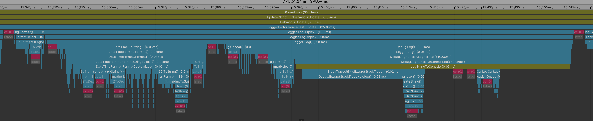

# Unity Log System

Unity Log System是一个用于Unity游戏引擎的 ~~高性能、可配置（高不高性能再说吧还没测）~~ 的日志系统。提供了类似于Unreal Engine的日志功能 ~~（其实是想照抄的）~~ ，支持不同的日志等级、不同构建版本的日志输出控制、日志写入文件以及日志着色等功能。

## 特点

已完成的部分：

- &#9745; 区分Log级别
- &#9745; 通过设置指定当前输出的Log级别
- &#9745; 将log写入文件，包含时间戳和当前log级别，并且会在创建新log的时候备份旧文件
- &#9745; 对常用的Log级别进行了函数包装，减轻使用负担
- &#9745; 性能测试

进行中的目标：

- &#9744; 根据游戏的构建版本（Editor、Development、Release）控制日志的输出。
- &#9744; 日志写入的性能测试

<!-- ## 安装

1. 将`Logger`文件夹复制到你的Unity项目的`Assets`目录中。
2. 在游戏启动时调用`Logger.Initialize()`方法初始化日志系统。 -->

## 使用

```csharp
// Display 日志
Logger.LogDisplay("This is a display log message.");
// Warning 日志
Logger.LogWarning("This is a warning log message.");
// Error 日志
Logger.LogError("This is an error log message.");
```

## 性能表现

Deep Profiler + Callstack 下的具体情况：



--- 

本项目使用JetBrains Rider进行开发，IDE License由JetBrains 开源项目申请提供

<p>
<a href="https://www.jetbrains.com/"/>

</a>
<a href="https://www.jetbrains.com/rider/"/>

</a>
<a href="https://www.jetbrains.com/lp/rider-unreal/"/>

</a>
</p>

<font size = 5> [**JetBrains 开源项目支持申请链接**](https://www.jetbrains.com/lp/rider-unreal/)</font>

推荐使用Rider进行Unity开发。